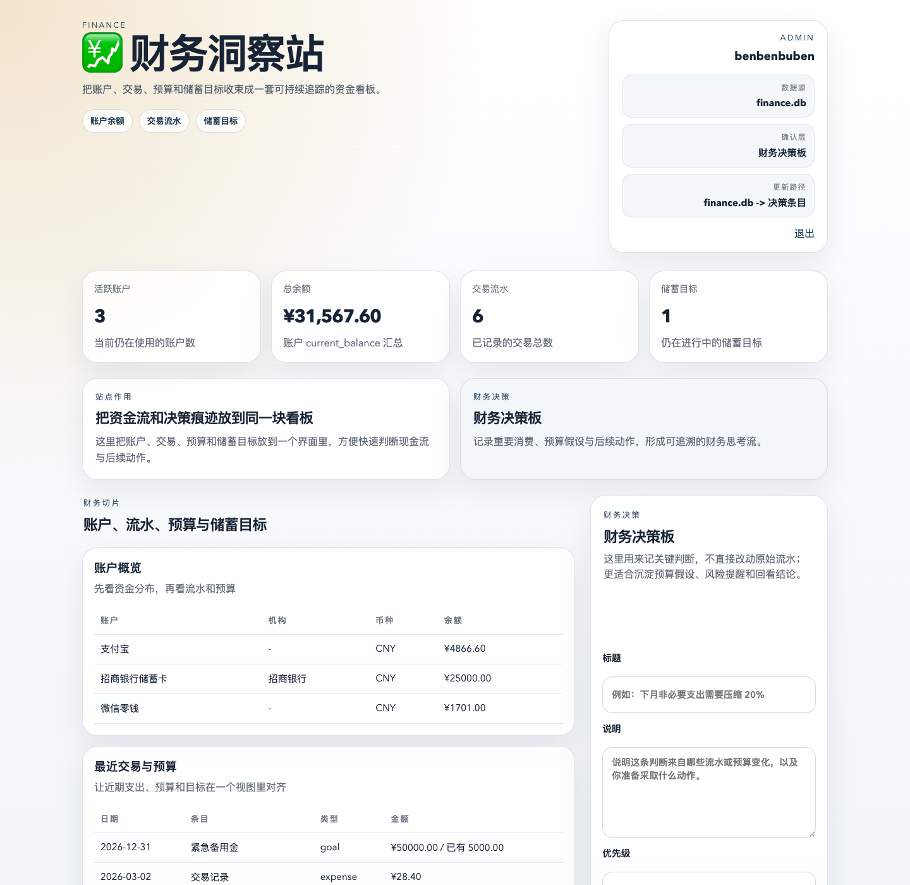

# Benfinance

Benfinance 是财务洞察站，负责把 `finance.db` 里的账户、流水、预算和储蓄目标整理成一个可回看的资金看板。



## 当前能力

- 读取根目录 `database/finance.db`，展示账户概览、最近交易、预算和储蓄目标。
- 提供本地 `focus_entries`，记录预算判断、重要消费与后续决策动作。
- 支持本地登录与 `Benbot` 的 `/auth/sso` 单点登录。
- 暴露 HTML UI、`/api/dashboard` 和健康检查接口。

## 数据边界

- 只读源数据：`/Users/ben/Desktop/myapp/Ben_cloud/database/finance.db`
- 本站运行数据：`/Users/ben/Desktop/myapp/Ben_cloud/Benfinance/data/benfinance.sqlite`
- 日志目录：`/Users/ben/Desktop/myapp/Ben_cloud/Benfinance/logs/`

## 页面结构

- 首页：资金概览、财务切片、财务决策板
- 登录页：本地账号密码登录
- SSO 入口：`/auth/sso`

## 启动

```bash
cd /Users/ben/Desktop/myapp/Ben_cloud/Benfinance
./benfinance.sh init-env
./benfinance.sh install
./benfinance.sh start
```

默认地址：`http://127.0.0.1:9100`

## 测试

```bash
cd /Users/ben/Desktop/myapp/Ben_cloud/Benfinance
make test
```
