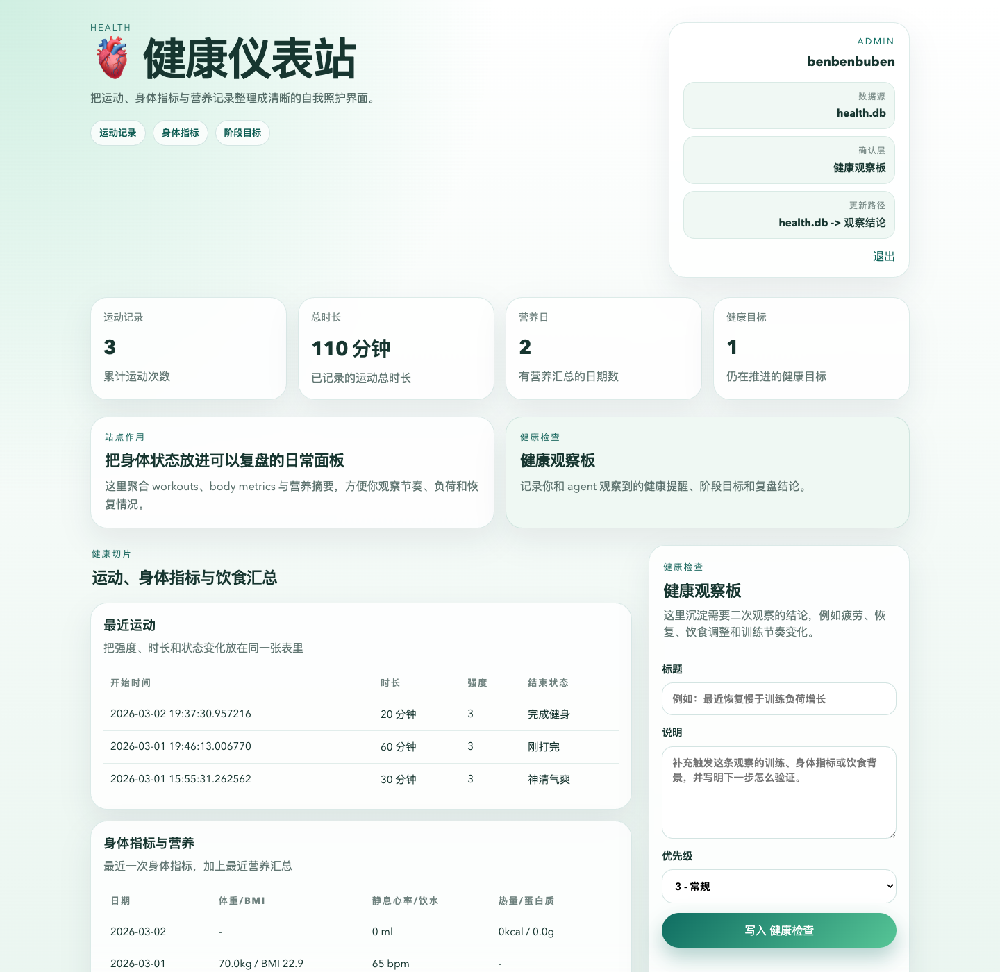

# Benhealth

Benhealth 是健康仪表站，负责把 `health.db` 里的运动、身体指标和营养摘要整理成可复盘的健康界面。



## 当前能力

- 读取根目录 `database/health.db`，展示运动记录、身体指标和营养汇总。
- 提供本地 `focus_entries`，记录需要继续观察的健康提醒、训练结论和阶段目标。
- 支持本地登录与 `Benbot` 的 `/auth/sso` 单点登录。
- 暴露 HTML UI、`/api/dashboard` 和健康检查接口。

## 数据边界

- 只读源数据：`/Users/ben/Desktop/myapp/Ben_cloud/database/health.db`
- 本站运行数据：`/Users/ben/Desktop/myapp/Ben_cloud/Benhealth/data/benhealth.sqlite`
- 日志目录：`/Users/ben/Desktop/myapp/Ben_cloud/Benhealth/logs/`

## 页面结构

- 首页：健康概览、健康切片、健康观察板
- 登录页：本地账号密码登录
- SSO 入口：`/auth/sso`

## 启动

```bash
cd /Users/ben/Desktop/myapp/Ben_cloud/Benhealth
./benhealth.sh init-env
./benhealth.sh install
./benhealth.sh start
```

默认地址：`http://127.0.0.1:8900`

## 测试

```bash
cd /Users/ben/Desktop/myapp/Ben_cloud/Benhealth
make test
```
